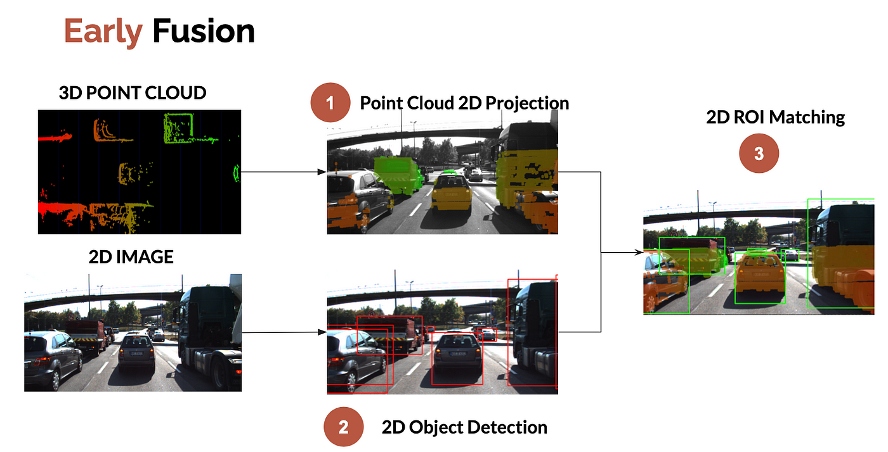

# Camera Lidar Sensor Fusion

## Early Fusion

<div align="Left">
    
</div>

### Camera detections & point cloud visualization

<div align="Left">
    
</div>

## LiDAR points Fused with YOLO detections

<div align="Left">
    
</div>

## LiDAR and Image Fusion Process

- **LiDAR Projection:** This file stores LiDAR points projected onto the image using camera calibration data.
- **Object Detection:** Only points within YOLO's bounding boxes for the desired objects are kept.
- **Outlier Filtering:** Filtering removes outliers, which are points that don't truly belong to the objects.
- **Bounding Box Adjustment:** Two methods are explored for outlier removal:
  - Shrinking bounding boxes to ensure only points truly belonging to the objects are considered.
  - Applying the Sigma Rule to keep points within 1 or 2 standard deviations of the average distance, based on point distances.
- **Focus on Specific Objects:** This filtering ensures the data focuses on the specific objects of interest.


### 2. Getting Started

#### 2.1 Requirements
```shell script
git clone https://github.com/Vishalkagade/Camera-Lidar-Sensor-Fusion.git
cd Camera-Lidar-Sensor-Fusion/
pip install -r requirements.txt

```

#### 2.2 Data preperation
Download the 3D KITTI detection dataset from [here](http://www.cvlibs.net/datasets/kitti/eval_object.php?obj_benchmark=3d).

The downloaded data includes:

- Velodyne point clouds _**(29 GB)**_
- Training labels of object data set _**(5 MB)**_
- Camera calibration matrices of object data set _**(16 MB)**_
- **Left color images** of object data set _**(12 GB)**_ (For visualization purpose only)

Note- In repository, the required dataset for testing is already added in ./data folder. So for interference, no need to download.But in caseif you want to run it on video, then you need to download the dataset.

#### 2.3. How to run

##### 2.3.2. Inference

```
python test.py --model yolov8s.pt --img_path data/img --pcd_path data/velodyne --label_path data/label --calib_path data/calib

```
## Contact

If you think this work is useful, please give me a star! <br>
If you find any errors or have any suggestions, please contact me (**Email:** `kagadevishal@gmail.com`). <br>
Thank you!